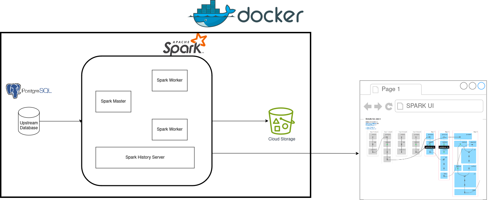

Code for my [Efficient Data Processing in Spark](https://josephmachado.podia.com/efficient-data-processing-in-spark?coupon=SUBSPECIAL524) course.

# Efficient Data Processing in Spark 
- [Efficient Data Processing in Spark](#efficient-data-processing-in-spark)
  - [Setup](#setup)
    - [Create aliases for long commands with a Makefile](#create-aliases-for-long-commands-with-a-makefile)
    - [Run a Jupyter notebook](#run-a-jupyter-notebook)
  - [Infrastructure](#infrastructure)


Repository for examples and exercises from the "Efficient Data Processing in Spark" course (under [data-processing-spark](./data-processing-spark/)). The capstone project is also present in this repository (under [capstone/rainforest](./capstone/rainforest/)).

## Setup

In order to run the project you'll need to install the following:
 
1. [git version >= 2.37.1](https://github.com/git-guides/install-git)
2. [Docker version >= 20.10.17](https://docs.docker.com/engine/install/) and [Docker compose v2 version >= v2.10.2](https://docs.docker.com/compose/#compose-v2-and-the-new-docker-compose-command).

**Windows users**: please setup WSL and a local Ubuntu Virtual machine following **[the instructions here](https://ubuntu.com/tutorials/install-ubuntu-on-wsl2-on-windows-10#1-overview)**. Install the above prerequisites on your ubuntu terminal; if you have trouble installing docker, follow **[the steps here](https://www.digitalocean.com/community/tutorials/how-to-install-and-use-docker-on-ubuntu-22-04#step-1-installing-docker)** (only Step 1 is necessary). Please install the **make** command with `sudo apt install make -y` (if its not already present). 

All the commands shown below are to be run via the terminal (use the Ubuntu terminal for WSL users). The `make` commands in this book should be run in the `efficient_data_processing_spark` folder. We will use docker to set up our containers. Clone and move into the lab repository, as shown below.

**Note**: If you are using mac M1 or later, please replace the "FROM deltaio/delta-docker:latest" in [data-processing-spark/1-lab-setup/containers/spark/Dockerfile](./data-processing-spark/1-lab-setup/containers/spark/Dockerfile) with "FROM deltaio/delta-docker:latest_arm64"


```bash
git clone https://github.com/josephmachado/efficient_data_processing_spark.git
cd efficient_data_processing_spark
# Start docker containers and create data for exercises and capstone project
# If you are using mac M1, please replace the "FROM deltaio/delta-docker:latest" 
# in data-processing-spark/1-lab-setup/containers/spark/Dockerfile
# with "FROM deltaio/delta-docker:latest_arm64"
make restart && make setup
```

### Create aliases for long commands with a Makefile

**Makefile** lets you define shortcuts for commands that you might want to run, E.g., in our <u>[Makefile](https://github.com/josephmachado/efficient_data_processing_spark/blob/main/Makefile)</u>, we set the alias `spark-sql` for the command that opens us a spark sql session.

We have some helpful **make** commands for working with our systems. Shown below are the make commands and their definitions

1. `make restart`: Stops running docker containers(if any) and starts new containers for our data infra.
2. `make setup`: Generates data and [loads them into tables](https://github.com/josephmachado/efficient_data_processing_spark/blob/main/containers/spark/setup.sql) and starts spark histroy server where we can see logs/Spark UI for already completed jobs.
3. `make spark-sql`: Open a spark sql session; Use exit to quit the cli. **This is where you will type your SQL queries**.
4. `make cr`: To run our pyspark code by pasting the relative path of exercise/example problems under [data-processing-spark](./data-processing-spark/) folder. See example image shown below.
5. `make rainforest`: Runs our rainforest capstone project, the entry point for this code is [here](./capstone/run_code.py)

This is how you run pyspark exercise files:


You can see the commands in <u>[this Makefile](https://github.com/josephmachado/efficient_data_processing_spark/blob/main/Makefile)</u>. If your terminal does not support **make** commands, please use the commands in <u>[the Makefile](https://github.com/josephmachado/efficient_data_processing_spark/blob/main/Makefile)</u> directly. All the commands in this book assume that you have the docker containers running.

You can test and run the capstone project as:

```bash
make pytest # to run all test cases
make ci # to run linting, formatting, and type checks
make rainforest # to run our ETL and create the final reports
```
### Run a Jupyter notebook

Use the following command to start a jupyter server:

```bash
make notebook
```

You will see a link displayed with the format http://127.0.0.1:3000/?token=your-token, click it to open the jupyter notebook on your browser. You can use [local jupyter notebook sample](./assets/sample_jupyter_notebook.ipynb) to get started.

You can stop the jupyter server with ctrl + c.

## Infrastructure 

We have three major services that run together, they are

1. **Postgres database**: We use a postgres data base to simulate an upstream application database for our rainforest capstone project.
2. **Spark cluster**: We create a spark cluster with a master and 2 workers which is where the data is processed. The spark cluster also includes a history server, which displays the logs and resource utilization (Spark UI) for completed/failed spark applications.
3. **Minio**: Minio is an open source software that has fully compatable API with AWS S3 cloud storage system. We use minio to replicate S3 locally.



All our Spark images are built from the official Spark Delta image, and have the necessary modules installed. You can find the docker files defined [here](./data-processing-spark/1-lab-setup/containers/)


## Testing push
